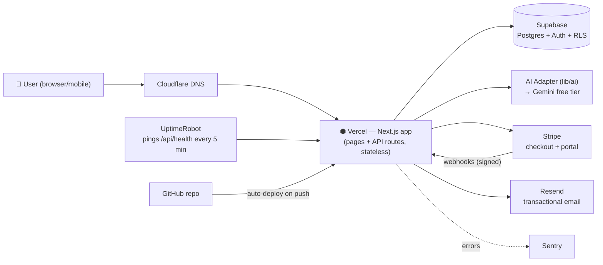
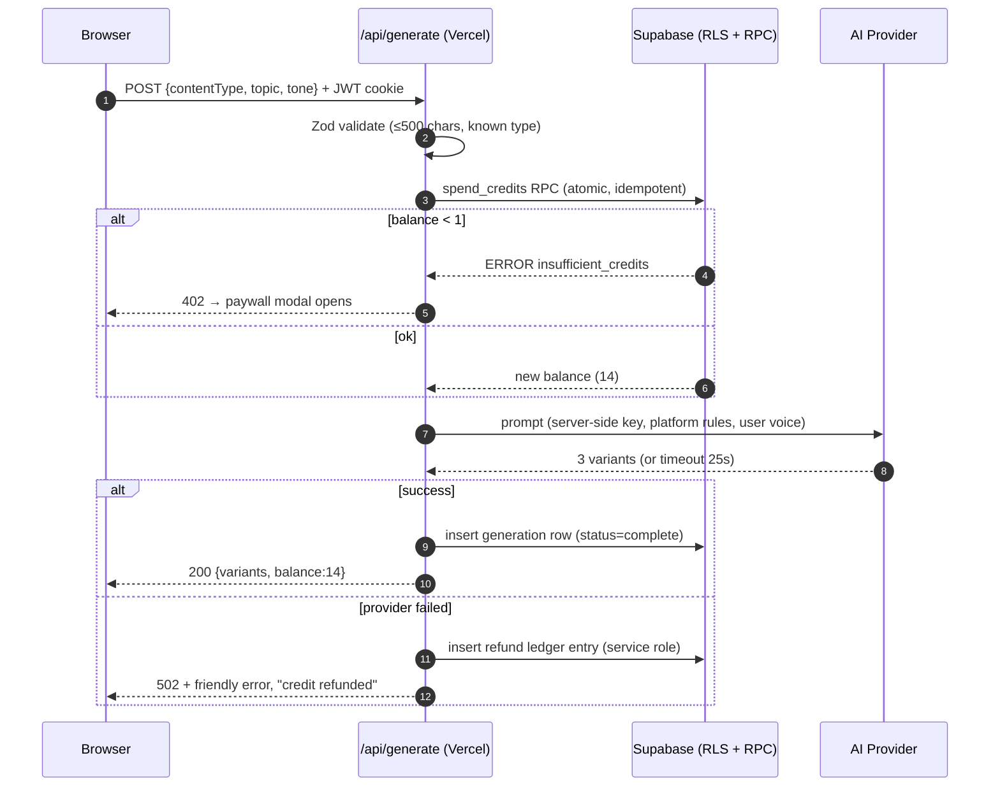
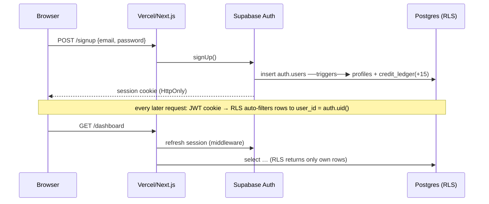
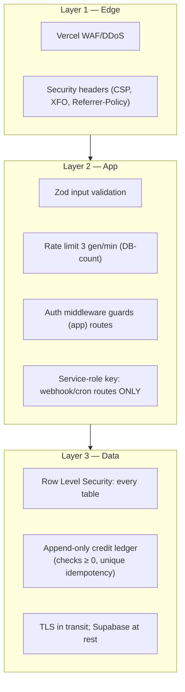

# Architecture — System, Security & Failure Playbooks
## Draftly

All diagrams are **Mermaid**: view rendered on GitHub, or in VS Code with the "Markdown Preview Mermaid Support" extension.

---

## 1. The system at a glance



**Why this shape for a solopreneur:** every box is a managed service with a free tier; the ONLY thing we own is the Next.js code. App servers are stateless (no sessions on disk) → scaling = Vercel adds instances automatically.

---

## 2. Request lifecycle: one generation (the money path)



---

## 3. Auth flow



---

## 4. Billing flow (Stripe — never trust the client)

```mermaid
sequenceDiagram
    participant B as Browser
    participant A as Next.js API
    participant ST as Stripe
    participant DB as Supabase

    B->>A: "Upgrade"
    A->>ST: create Checkout Session (sub, $9/mo, client_reference_id=user_id)
    A-->>B: redirect url
    B->>ST: pays (card/UPI)
    ST->>A: POST /api/stripe/webhook (checkout.session.completed) — signature verified
    A->>DB: upsert subscriptions; plan='pro'; ledger +500 (idempotent by event id)
    B->>A: GET /billing/welcome (polls)
    A-->>B: confirmed → confetti, 500 credits
    Note over A,DB: nightly cron reconciles DB ↔ Stripe (missed webhook self-heals ≤24h)
```

---

## 5. Security layers (defense in depth)



Plain-English: even if an attacker bypasses the app, the database refuses to show rows that aren't theirs; even if a bug double-fires a charge, the ledger's unique key makes the second write fail silently.

---

## 6. Failure modes & what happens (risk management)

| # | Failure | User sees | System does | Detected by |
|---|---|---|---|---|
| F1 | AI provider down / rate-limited | Friendly error, credit auto-refunded | Retry once → mark failed → refund ledger entry | Sentry alert, error_code counts |
| F2 | Bad deploy | — | Vercel **instant rollback** (one click) | UptimeRobot within 5 min |
| F3 | Supabase outage (rare) | Maintenance page via `/api/health` check | Health endpoint reports db:down | UptimeRobot → phone push |
| F4 | Free-tier project auto-pause | Same as F3 | Doesn't happen: UptimeRobot's 5-min pings count as activity; upgrade at first paying user | UptimeRobot |
| F5 | Stripe webhook lost | "Confirming…" spinner | Welcome page polls; nightly cron reconciles from Stripe API — state self-heals | Cron log + reconciliation diff |
| F6 | Traffic spike (front page of X) | Slower generations, that's all | Vercel autoscales; credits cap AI cost; DB rate limit blocks abuse | Vercel analytics + PostHog spike |
| F7 | Data disaster (accidental deletion) | Brief restore window | Weekly pg_dump to private GitHub repo (Stage 7); Supabase PITR once Pro | Backup action's success check |

---

## 7. RUNBOOK — "the app is down" (print this, Stage 7)

1. **Don't panic-code.** Open UptimeRobot alert → which check failed: `https` or `content`?
2. **Triage 60 seconds:** Vercel status page? Supabase status page? Stripe status? If a vendor is down → tweet status-page link from status page, wait. Their ops team > our hotfix.
3. **If it's our deploy:** Vercel → Deployments → previous good → **Rollback**. Verify `/api/health` = 200.
4. **If it's data:** Sentry → top error → reproduce locally with prod env vars (read-only!).
5. **Communicate within 10 min:** status page note ("investigating") → fix → ("resolved") → 5-line postmortem in DECISIONS.md.

---

## 8. Scaling ladder (when, not if)

| Stage | Users | Move | Why |
|---|---|---|---|
| Now | 0–1k | As specced | Free tiers handle it |
| 1 | 1k–10k | Supabase Pro + Vercel Pro | No pause, PITR backups, more bandwidth |
| 2 | 10k–100k | Upstash Redis (rate limits out of DB), Inngest queue for generations | Decouple AI latency from UI; real rate limiting |
| 3 | 100k–1M | Read replica, multi-region, CDN-cache marketing pages, paid AI tier + model routing | Reads scale; cost per generation becomes the P&L line |

The code we write in Stage 2 (stateless routes, adapter AI, ledger credits) is chosen so each move above is a config/billing change — **not a rewrite**.
