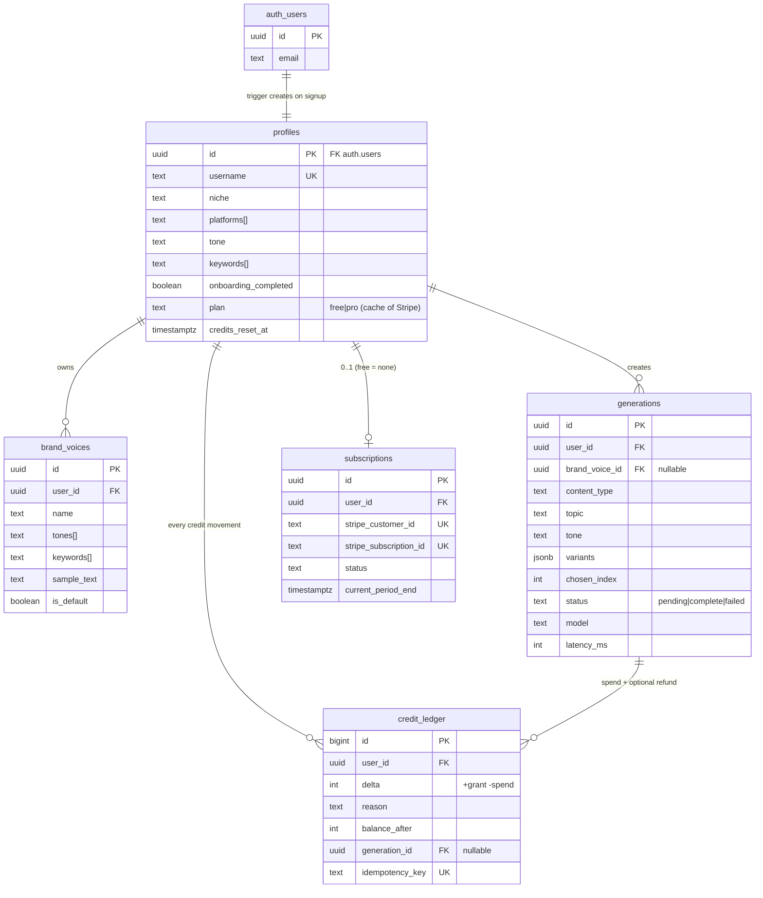

# Backend Schema — Database Design
## Draftly · Supabase Postgres

**Principles:**
1. **Row Level Security on every table** — the database itself refuses unauthorized reads, even if app code has a bug.
2. **Credits live in an append-only ledger** — balances are derived, never mutated. Auditable money-truth.
3. All timestamps UTC (`timestamptz`). All ids `uuid` (except ledger: bigint for ordering).
4. Deletes cascade from user (GDPR "delete my data" = delete auth user, done).

---

## 1. ERD (visual — renders on GitHub / VS Code Markdown preview)



---

## 2. Tables (DDL — goes to `supabase/migrations/0001_init.sql`)

```sql
-- ============ PROFILES (1:1 with Supabase auth.users) ============
create table public.profiles (
  id                   uuid primary key references auth.users(id) on delete cascade,
  username             text unique,
  full_name            text,
  niche                text,
  platforms            text[] not null default '{}',
  tone                 text not null default 'chill',
  keywords             text[] not null default '{}',
  timezone             text not null default 'utc',
  onboarding_completed boolean not null default false,
  plan                 text not null default 'free'
                       check (plan in ('free','pro')),
  credits_reset_at     timestamptz not null default (now() + interval '30 days'),
  created_at           timestamptz not null default now(),
  updated_at           timestamptz not null default now()
);

-- ============ BRAND VOICES (v1 uses row #1 from onboarding) ============
create table public.brand_voices (
  id          uuid primary key default gen_random_uuid(),
  user_id     uuid not null references public.profiles(id) on delete cascade,
  name        text not null default 'My voice',
  tones       text[] not null default '{}',
  keywords    text[] not null default '{}',
  sample_text text,
  is_default  boolean not null default false,
  created_at  timestamptz not null default now()
);

-- ============ GENERATIONS ============
create table public.generations (
  id             uuid primary key default gen_random_uuid(),
  user_id        uuid not null references public.profiles(id) on delete cascade,
  brand_voice_id uuid references public.brand_voices(id) on delete set null,
  content_type   text not null check (content_type in
                   ('ig_caption','reel_hook','x_thread','x_post','linkedin_post','yt_desc')),
  topic          text not null check (char_length(topic) between 3 and 500),
  tone           text not null,
  variants       jsonb not null default '[]',   -- [{text, favorited}]
  chosen_index   int,
  status         text not null default 'pending'
                 check (status in ('pending','complete','failed')),
  error_code     text,
  model          text,
  latency_ms     int,
  created_at     timestamptz not null default now()
);

-- ============ CREDIT LEDGER (append-only; source of credit truth) ============
create table public.credit_ledger (
  id              bigint generated always as identity primary key,
  user_id         uuid not null references public.profiles(id) on delete cascade,
  delta           int not null,
  reason          text not null check (reason in
                    ('signup_grant','monthly_grant','plan_grant','generation','refund','admin_adjust')),
  balance_after   int not null check (balance_after >= 0),
  generation_id   uuid references public.generations(id) on delete set null,
  idempotency_key text unique not null,
  created_at      timestamptz not null default now()
);
-- App role gets INSERT+SELECT only; UPDATE/DELETE revoked (append-only enforced)
revoke update, delete on public.credit_ledger from anon, authenticated;

-- ============ SUBSCRIPTIONS (Stripe mirror; Stripe = source of truth) ============
create table public.subscriptions (
  id                     uuid primary key default gen_random_uuid(),
  user_id                uuid not null references public.profiles(id) on delete cascade,
  stripe_customer_id     text unique,
  stripe_subscription_id text unique,
  status                 text not null check (status in
                           ('active','trialing','past_due','canceled','incomplete')),
  price_id               text,
  current_period_end     timestamptz,
  created_at             timestamptz not null default now(),
  updated_at             timestamptz not null default now()
);
```

---

## 3. Signup trigger (profile + first credits, atomically)

```sql
create or replace function public.handle_new_user()
returns trigger language plpgsql security definer set search_path = public as $$
begin
  insert into public.profiles (id) values (new.id);
  insert into public.credit_ledger (user_id, delta, reason, balance_after, idempotency_key)
  values (new.id, 15, 'signup_grant', 15, 'signup_' || new.id);
  return new;
end $$;

create trigger on_auth_user_created
  after insert on auth.users
  for each row execute function public.handle_new_user();
```

## 3b. Atomic spend function (the money-critical RPC)

```sql
create or replace function public.spend_credits(
  p_amount int, p_reason text, p_generation_id uuid
) returns int language plpgsql security definer set search_path = public as $$
declare v_balance int;
begin
  -- lock the newest row for this user: serializes concurrent spends
  select balance_after into v_balance
    from public.credit_ledger where user_id = auth.uid()
    order by id desc limit 1 for update;

  if v_balance is null or v_balance < p_amount then
    raise exception 'insufficient_credits';
  end if;

  insert into public.credit_ledger
    (user_id, delta, reason, balance_after, generation_id,
     idempotency_key)
  values
    (auth.uid(), -p_amount, p_reason, v_balance - p_amount, p_generation_id,
     'gen_' || p_generation_id);   -- unique → double-click can't double-charge

  return v_balance - p_amount;
end $$;
```

---

## 4. Row Level Security (the database bodyguard)

```sql
alter table public.profiles      enable row level security;
alter table public.brand_voices  enable row level security;
alter table public.generations   enable row level security;
alter table public.credit_ledger enable row level security;
alter table public.subscriptions enable row level security;

-- profiles: read/update own; inserts only via trigger (security definer)
create policy "profiles_select_own"  on public.profiles      for select using (auth.uid() = id);
create policy "profiles_update_own"  on public.profiles      for update using (auth.uid() = id);

create policy "voices_all_own"       on public.brand_voices  for all
  using (auth.uid() = user_id) with check (auth.uid() = user_id);

create policy "gen_select_own"       on public.generations   for select using (auth.uid() = user_id);
create policy "gen_insert_own"       on public.generations   for insert with check (auth.uid() = user_id);
create policy "gen_update_own"       on public.generations   for update using (auth.uid() = user_id);

create policy "ledger_select_own"    on public.credit_ledger for select using (auth.uid() = user_id);

create policy "subs_select_own"      on public.subscriptions for select using (auth.uid() = user_id);
```

> **Who can write subscriptions / grant plan credits?** Only the service-role key (Stripe webhook + cron routes) — it bypasses RLS by design and never ships to the browser. Attacker test in Stage 7: login as user A, attempt to read user B's rows via the API → must fail.

---

## 5. Indexes

```sql
create index idx_generations_user_created on public.generations (user_id, created_at desc);
create index idx_ledger_user_id           on public.credit_ledger (user_id, id desc);
create index idx_ledger_reason_time       on public.credit_ledger (reason, created_at desc);
create index idx_subscriptions_customer   on public.subscriptions (stripe_customer_id);
```

---

## 6. Data lifecycle & privacy

- **Stored:** generations (product feature), profile prefs, ledger (financial records — keep 7y for tax).
- **Never stored:** payment card data (Stripe only, ever), passwords (Supabase Auth hashes), analytics PII beyond event props.
- **Delete-my-data:** deletes `auth.users` row → every table cascades (except anonymized ledger: user_id nulled, deltas kept for accounting).
- **Backups:** Supabase free = none automatic → weekly `pg_dump` via GitHub Action to private repo (Stage 7) + upgrade trigger: first paying customer (gets PITR).
